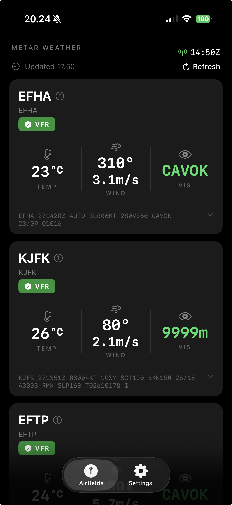

# METAR Weather

A clean iOS app for reading airport weather (METAR) at a glance — temperature, wind, and
visibility for the airports you care about, on the home screen and in a widget.

  

## Why?

The goal of this project was to fetch airport METAR weather data and display it in the format
I prefer.

In my daily work life I need temperature, wind speed, and visibility for a few nearby airports
to be easy to glance at. So I decided to try out how this "new" way of AI-assisted development
works. The app was built mostly with Claude Sonnet 4.6 and Opus 4.8 (medium to high effort);
early on I also used Gemini Pro.

I'd like to get this published to the App Store.

## Features

- **Airfield cards** — temperature, wind (direction + speed), and visibility for each airport,
  with a colour-coded flight-condition badge (VFR / MVFR / IFR / LIFR).
- **Full METAR decode** — tap the raw METAR line on any card to expand a complete,
  human-readable breakdown (wind, clouds, weather phenomena, QNH, trend, and more).
- **Manage airports** — add by ICAO code, remove, and drag to reorder from the Settings page.
- **Unit options** — temperature in °C / °F and wind in knots / m/s / mph.
- **Home-screen widget** — a compact card (small & medium) that is **configurable**: pick which
  saved airport each widget shows.
- **Auto-refresh** — both the app and the widget refresh roughly every 30 minutes; the app also
  refreshes when brought back to the foreground.

## How it works

You add airports by their 4-letter **ICAO code** (e.g. `EFHA`, `KJFK`). For each code the app
fetches:

1. **Airport info** — name and any published radio frequencies.
2. **METAR** — the current observation, which is parsed for the card metrics and the full decode.

The app and the widget share data through an App Group, so the widget stays in sync with your
saved airports and units.

All weather and airport data is provided by **[aviationweather.gov](https://aviationweather.gov)**
(NOAA / National Weather Service). Thank you for that!

## Tech

- **SwiftUI** app with a **WidgetKit** extension (configurable via **AppIntents**).
- Data sharing between app and widget via an **App Group**.
- Targets **iOS 18+**.

## Status

Working and in use; cleaning things up with the aim of an App Store release.

> ⚠️ This app is for situational awareness only and is **not** an approved source for flight
> planning or operational decisions. Always use official aviation weather briefings.
</content>
</invoke>
